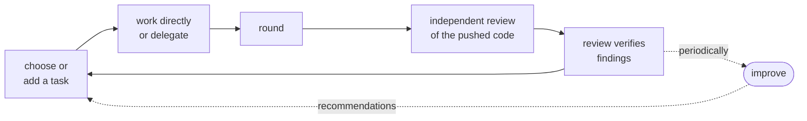

<div align="center">

<picture>
  <source media="(prefers-color-scheme: dark)" srcset="assets/logo-dark.png">
  
</picture>

### Agents forget. Projects shouldn't.

*Prevent intent drift and context loss in long-horizon development*

<p align="center">


</p>

</div>

Waystone is a Claude Code and Codex plugin that gives a project a durable source of direction, a validated task list, bounded work cycles, independent review, and a way to learn from past agent sessions. It is built for research and software projects that span many sessions or agents — where context, decisions, and verification evidence would otherwise scatter across chats and memory files.

> **Status:** v0.11 Anchor & Attest is the current release. Completion judgments — review receipts, delegation verdicts, round closeouts — now derive only from immutable, re-derivable evidence: digest-bound request generations, read-time re-derivation of reviewer replies, and identity-attested runner probes, with honest failure modes across mixed-version and mixed-machine states. Next: enforceable guards, recorded waivers, and larger-scale orchestration.

<br>

## Why waystone

- **Direction that survives sessions.** One durable project-direction document, plus a re-entry note written before compaction or exit, so a later session continues without reconstructing context.
- **Evidence, not "done".** Reviewer comments are treated as claims and verified against the code before they become tracked work.
- **Acceptance with evidence.** Delegated work runs in an isolated worktree, and nothing lands without a recorded criterion-by-criterion verdict backed by verification evidence — every decision stays auditable and reversible.
- **Cheap by default.** Most validation, rendering, bookkeeping, and log parsing are plain scripts that spend no model tokens.

<br>

## Install

Requirements: `git`, `bash`, and [`uv`](https://docs.astral.sh/uv/).

Claude Code:

```text
/plugin marketplace add Dev-Jahn/jahns-cc-marketplace
/plugin install waystone
```

Restart Claude Code afterward so the hooks load.

Codex:

```bash
codex plugin marketplace add Dev-Jahn/jahns-codex-marketplace
codex plugin add waystone@jahns-codex-marketplace
```

Restart Codex, then review and trust the installed hooks with `/hooks`. Codex intentionally does not
run untrusted plugin hooks until their exact hash is approved.

<details>
<summary>Local development</summary>

<br>

```bash
claude --plugin-dir ~/workspace/waystone
```

For Codex development, add a local marketplace containing the checkout and install its `waystone`
entry; the repository CI performs this same install smoke test.

</details>

<br>

## Quick start

For a new or half-formed project:

```text
Claude Code: /waystone:ideate "one-line project idea"   # optional
Claude Code: /waystone:init
Codex:      $waystone:ideate "one-line project idea"    # optional
Codex:      $waystone:init
```

`ideate` turns the idea into `SSOT.md`, a concise project-direction document. `init` then builds the
working structure around it and asks separately for the initial policy level (`observe-only` or
`warn-allowed`) and whether delegation worktrees/runners are enabled. New projects bind review
through `role:reviewer`; older explicit literal reviewer lists remain valid. For an existing project,
run `/waystone:init` (Claude Code) or `$waystone:init` (Codex) alone — setup is non-destructive:
Waystone adapts to existing files, leaves changes uncommitted for review, and applies its conventions
only from that point forward.

A normal cycle:



```text
Claude Code: /waystone:round    Codex: $waystone:round
cat > /tmp/review.md             # paste the external reviewer's reply, then Ctrl-D
Claude Code: /waystone:review   Codex: $waystone:review
```

Fix confirmed issues and start the next round. Run `/waystone:improve` or `$waystone:improve`
periodically to analyze past sessions and review results.

<br>

## Available commands

| Claude Code | Codex | Purpose |
|---|---|---|
| `/waystone:ideate` | `$waystone:ideate` | Turns a rough idea into `SSOT.md`, a concise project-direction document. No repository required. |
| `/waystone:init` | `$waystone:init` | Sets up a new project or adds Waystone to an existing one without rewriting its history. |
| `/waystone:round` | `$waystone:round` | Closes a bounded work cycle, updates progress, refreshes generated views, and creates a review request. |
| `/waystone:review` | `$waystone:review` | Preserves a reviewer reply exactly, verifies each issue, and turns confirmed issues into tasks. |
| `/waystone:delegate` | `$waystone:delegate` | Autonomously runs one task in an isolated worktree, verifies it, and resolves it with a recorded evidence-backed verdict. |
| `/waystone:status` | `$waystone:status` | Shows active, blocked, parked, and pending work across registered local or remote projects. |
| `/waystone:improve` | `$waystone:improve` | Analyzes host session history and review evidence, then proposes evidence-backed workflow improvements. |

<details>
<summary>What an initialized project remembers, and how a session re-enters it</summary>

<br>

An initialized project keeps the main project direction in one document (when it has one), active work and dependencies in `tasks.yaml`, a generated visual roadmap in `ROADMAP.md`, recent work-cycle history in `PROGRESS.md`, decisions in `docs/adr/`, and review requests and feedback in `docs/reviews/`.

On session start or resume, the host receives a short operating summary, the project digest, active tasks, and the next useful action. Waystone stores a small re-entry note before compaction on both hosts and before Claude Code exits, so a later session can continue without reconstructing the whole context.

Most validation, rendering, bookkeeping, log parsing, and policy checks are plain scripts and spend no model tokens.

</details>

## Internal features

<details>
<summary>CLI surfaces the skills drive for you</summary>

<br>

| Command | Purpose |
|---|---|
| `waystone task ...` | Validated task-registry CLI — adds, updates, lists, and archives tasks without slurping the file. |
| `waystone task set <id> --scope-add <prefix>` | Appends a validated repo-relative task boundary for scope-drift evaluation. |
| `waystone paths` | Shows the resolved project-state, machine-state, and worktree-cache locations. |
| `waystone project` | Registers, unregisters, and lists projects through the machine-wide registry. |
| `waystone delegate plan --json` | Emits an immutable fan-out manifest for a set of decided tasks — dependency-gated, corrupt-fail-closed — that a deterministic-workflow carrier carries. |
| `waystone delegate run --json-events --expect-packet-sha` | Runs one delegation; `--json-events` streams pure NDJSON on stdout, `--expect-packet-sha` (with `--expect-profile`) refuses a stale dispatch before any work starts, and `--carrier` / `--carrier-instance` record carrier attribution in the immutable packet. |
| `waystone delegate status --json` | Reports delegation state (including `corrupt`) with an exact `task_id` field for machine consumption. |
| `waystone delegate verify` | Re-runs independent read-only verification of a delegation result in its preserved worktree. |
| `waystone delegate verdict` | Records the main session's evidence-backed apply or discard decision before resolution. |
| `waystone round close --route-note <role>,<execution>,<backend>` | Records an actually used host-guided route in the immutable round exposure; repeat once per route. |
| `waystone overlay` | Stores adaptive checks and manages their observing/warning lifecycle; promotion to warning requires deterministic shadow replay. |
| `waystone overlay compose` | Shows the effective base, user, project, and current-round policy plus conflicts and shadowed entries. |
| `waystone overlay promote-user` | Promotes a user-scope candidate only after evidence from at least two registered projects. |
| `waystone overlay materialize` | Writes a consent-approved, rule-named sanitized policy to `docs/waystone-policy.yaml`, keeps delta provenance only in local state, and leaves the policy uncommitted. |
| `waystone consent record` | Records candidate-bound user consent for materialization or managed installation. The command group is `waystone consent`. |
| `waystone install agents` / `waystone install hooks` | Installs a consent-approved managed project agent or enables the plugin-owned boundary hook. Hook enablement creates `.waystone/boundary-hooks-enabled` for both Claude Code and Codex and never writes `.claude/settings.json`; remove the marker to roll it back. The command group is `waystone install`. |
| `waystone check` | Evaluates active overlay rules against the current project state; warnings are visible but never block the host command. |
| `waystone statusline` | Renders one read-only derived-state line (tasks done/total, round, pending reviews, blockers) for the host status line; degrades to an empty segment in cold or corrupt environments. |
| `waystone install statusline` | Consent-gated managed install of the statusline command hook; refuses to overwrite an existing `statusLine` setting. |
| `waystone improve evidence` | Deterministically joins review findings and delegation records by task ID into a local evidence log. |
| `waystone improve metrics` | Appends named §15 metrics and a factual comparison with the previous same-scope snapshot. |

</details>

<br>

Task status follows `pending → active → done`, with `blocked`, `parked`, and `dropped` side
states. `parked` means intentionally deferred: record the reason in `notes`; it is neither
actionable nor auto-archived.

## Rounds and independent review

A **round** is a bounded cycle of implementation, verification, push, and review. Closing one updates task status and progress, refreshes generated views, checks that the reviewed commit is pushed, and writes a short review request naming the important files, claims, evidence, and known weak points.

The project chooses one review mode during setup:

- **Packet mode** (default) — give the generated Markdown request to any capable external reviewer.
- **PR mode** — for pull-request workflows. Review, CI, issue resolution, and final approval are tied to the exact commit being merged, so an old review cannot approve a newer push.

PR freeze also writes a round-bound local SHA sidecar, allowing `improve` to project the reviewed
head/base without querying GitHub again; rounds predating that evidence remain unknown. Reviewer
comments are treated as claims, not facts. The `review` skill assigns one of six finding taxonomy
types while checking them against the code before confirmed issues become tracked work.

<br>

## Delegate a task without losing control

The `delegate` skill autonomously closes one registered task whose acceptance criteria are already
recorded or can be derived exactly from owner-authored project material — without ever letting the
implementation agent grade its own work. Two layers share the job:

- **`/waystone:delegate` — the skill.** Routes the task through eight policy questions (reasoning,
  context inheritance, independent perspective, bounded scope, repetitive tools, retry cost,
  independent verification, budget sensitivity), records owner-derived criteria with
  `waystone task set <id> --accept-add` and an exact path boundary with `waystone task set <id> --scope-add`
  *before* the run, and owns the accept/reject decision in the main session.
- **`waystone delegate <subcommand>` — the CLI.** Does the mechanical part: immutable records,
  isolated worktrees, harness-computed patches, independent verification, and audited state
  transitions.

The division of trust is fixed. Everything the worker claims stays labeled a claim — it never becomes
a fact merely because the report exists, and a missing report never means verification was absent.
Every fact that matters (base snapshot, changed files, patch bytes, digests) is computed by the
harness directly from Git. Nothing reaches your live tree until the main session records a
criterion-by-criterion verdict against the packet's acceptance criteria, verbatim, with cited
evidence — and you audit that record, not the worker's word.

Waystone stores bindings by responsibility (`main`, `orchestrator`, `implementer`, `clerk`,
`verifier`, `reviewer`) rather than baking model names into the workflow. `external-runner` is run by
Waystone; `clean-subagent`, `forked-subagent`, `deterministic-workflow`, and `main-session` are routed
through the host and attributed to the round. Bindings live in the project's uncommitted
`{project_root}/.waystone/profile.yml`; Waystone refuses to guess one when it is missing. Profile
`effort` accepts `none`, `minimal`, `low`, `medium`, `high`, `xhigh`, and `ultra`. `ultra` is
Codex-only and is passed unchanged as `model_reasoning_effort`; the Claude external runner rejects it
without substituting another effort. Omitting `effort` leaves the runner's configured default
untouched.

Human input is reserved for the cases the machine must not decide alone: criteria that cannot be
derived without invention, an unusable profile or binding, an apply judgment with an unrefuted
blocker, exhausted retries, repeated verifier transport failure, apply drift not wholly caused by the
current session, a deterministic runner failure, conflicting warning rules, a Claude external runner
that would need an unsandboxed override, or an explicit review request. When drift touches your
uncommitted work, Waystone never commits or stashes it — it reports the state and waits. In every
other case the main session continues through verdict and apply or discard.

<details>
<summary><b>How delegation works under the hood</b> — only read on if you're curious what each step
actually does.</summary>

### The lifecycle

```text
routing decision
  ├─ host-guided execution
  │    └─ main / subagent / workflow runs it directly
  │       (no delegation record; attributed at round close)
  │
  └─ external runner
       └─ run
           ├─ failed-env / failed-runner / failed-artifact
           │    └─ discard, then retry as a NEW run (with --note)
           │
           └─ needs-review
                ├─ verify     adds verification evidence, state unchanged
                ├─ verdict    records the judgment, state unchanged
                ├─ apply      patches the live tree        → applied
                └─ discard    drops the result             → discarded
```

The boundaries are deliberate:

- a successful `run` is **not** "done" — it is `needs-review`;
- `verify` produces evidence and judges nothing;
- `verdict` judges and touches nothing;
- `apply` applies the patch and *only* the patch — it does not commit, and it does not flip the task
  to done;
- `discard` can clean up any nonterminal record, verdict or not.

### Command map

| command | what it does | writes | state |
|---|---|---|---|
| `plan` | emit a fan-out manifest for several decided tasks | stdout JSON only | none |
| `run` | execute the bound implementer in an isolated worktree | record, refs, worktree, patch, contract | `claimed → running → needs-review / failed-*` |
| `status` | list delegation states | nothing | none |
| `show` | inspect patch / contract / verification / failure evidence | nothing | none |
| `verify` | run the independent verifier | `verify-N.json` | stays `needs-review` |
| `verdict` | record the main session's judgment | `verdict-N.json` | stays `needs-review` |
| `apply` | apply the approved patch to the live tree | live working tree | `needs-review → applied` |
| `discard` | drop the result, keep the audit trail | removes worktree/refs, keeps record | `* → discarding → discarded` |

### What `run` actually does

1. **Gates first.** Initialized project, recorded delegation consent, a sane Git state (no unborn
   HEAD, submodules, unmerged index, or in-progress merge/rebase), an `implementer/external-runner`
   binding, task state `pending|active`, **every dependency `done`**, non-empty acceptance criteria,
   and no other nonterminal delegation for the same task. A carrier-issued run also pins
   `--expect-packet-sha` and `--expect-profile` so a stale plan fails loudly instead of running.
2. **Claim.** A unique delegation ID (`20260718T123456Z-fix-something`) and a `claim.json` land
   before anything else, so even a crash leaves ownership recoverable.
3. **Snapshot.** Using a temporary index — your live branch and index are never touched — the exact
   current tree (HEAD + staged + unstaged + non-ignored untracked files) becomes an immutable base
   commit under `refs/waystone/delegations/<id>`, and a detached worktree is created from it under
   `~/.waystone/cache/worktrees/<project>/<id>/`. The implementer starts from what you were actually
   looking at, uncommitted work included.
4. **Immutable context.** The record keeps `packet.yaml` (task, acceptance, scope, routing context),
   `exposure.json` (base SHA, dirty flag, binding, profile fingerprint, sandbox), `status.json`
   (every state transition), and `prompt.txt` (the prompt as sent).
5. **Environment prep.** `delegation.env_prep` commands if configured; otherwise lockfile
   auto-detection (`uv.lock → uv sync --frozen`, `pnpm-lock.yaml → pnpm install --frozen-lockfile`,
   `package-lock.json → npm ci`, `Cargo.toml → cargo fetch`, `go.mod → go mod download`). A prep
   failure is `failed-env`, worktree preserved for diagnosis.
6. **The runner.** The Codex backend runs `codex exec` inside the worktree with the bound model,
   a `workspace-write` sandbox, and the bound `model_reasoning_effort`. The Claude backend has no
   OS-level confinement and is therefore refused by default — it runs only after explicit
   `--allow-unsandboxed-runner --reason`, recorded in the exposure. A one-time sandbox preflight
   probe per checkout catches environments where the sandbox silently blocks all writes.
7. **Harness-computed results.** After the runner exits, the result snapshot SHA, changed-file list,
   binary-safe patch, and patch digest are computed directly from Git into
   `artifact/contract.yaml` + `artifact/changes.patch`. The worker's structured report is excluded
   from the patch; its verification/limitations/risks enter the contract only under a
   `delegate-claimed` label. Success is `needs-review`; failures classify as `failed-env`,
   `failed-runner`, or `failed-artifact`, and are never retried silently.

### Independent verification — `waystone delegate verify`

Only valid on `needs-review`. The preserved worktree is force-normalized (`checkout --force --detach
<base>`, `clean -fd`, re-apply the exact patch), the rebuilt tree is checked against the contract's
result SHA, and the bound verifier runs Waystone's own adversarial-review prompt against the
acceptance criteria. A Codex verifier runs host-independent `codex exec` in a `read-only` sandbox
with `--output-schema` and `--output-last-message`; a Claude verifier gets read-only tools plus
before/after filesystem postconditions. If the verifier modified anything, its result is rejected.
Each pass appends `artifact/verify-N.json`; the newest one is what a later verdict must answer to.

### Judgment — `waystone delegate verdict`

`verdict` runs nothing. It validates and appends the main session's judgment file: the criteria must
match the packet's acceptance criteria verbatim, every `met: true` needs resolvable evidence
references, any verifier blocker must be individually refuted by cited direct checks plus an explicit
override `--reason`, and applying over an unmet criterion requires its own recorded override. The
harness then stamps provenance, the verify number it answers, the profile fingerprint, and
contract/patch digests, and appends `artifact/verdict-N.json`. New verification evidence makes an
older verdict stale.

### Resolution — `apply` / `discard`

`apply` demands a current `apply` verdict whose digests still match, then performs a plain
`git apply` — no 3-way merge, no stash, no conflict resolution; if your live tree drifted so the
patch no longer fits, the whole apply fails and says so. On success the cached worktree is removed,
the record and refs stay for audit, and the tree change is left uncommitted for you (or the round) to
commit. `discard` walks any nonterminal record through `discarding` (reason recorded, worktree and
refs removed, postconditions checked) to `discarded`, is safe to re-run if cleanup is interrupted,
and keeps the record directory forever. `--orphan` recovers the inverse crash: a leftover
worktree/ref whose record is gone.

### Fan-out — `waystone delegate plan --json`

`plan` starts nothing. It emits one immutable manifest — profile fingerprint, per-task packet
digests, declared scopes, dependency and scope-overlap analysis — that a deterministic-workflow
carrier consumes: scope-disjoint tasks run as parallel `run` lanes, overlapping or undeclared-scope
tasks run serially, and the carrier never verifies, judges, applies, or discards. Those calls stay
with the main session.

</details>

<br>

## Improve the workflow from real usage

The `improve` skill reads Claude Code logs from `$CLAUDE_CONFIG_DIR/projects` (or `~/.claude/projects`) and Codex rollouts from `$CODEX_HOME/sessions` (or `~/.codex/sessions`). By default it filters that history to the current project and combines it with the project's review and delegation records (joined deterministically by task ID via `waystone improve evidence`). `--user-wide` is an explicit cross-project mode for user-habit analysis. The skill looks for patterns such as:

- the main session doing large amounts of implementation directly;
- changes with little or no visible verification;
- repeated failed commands;
- very large tool outputs filling the main context;
- how work is delegated and where delegation would have been useful (`delegation_opportunity`);
- worker changes outside a task's declared scope (`worker_scope_drift`);
- warning fires and policy conflicts that create friction (`warn_friction`);
- general errors, separately from dependency/setup failures and failed environment preparation
  (`env_unpreparedness`);
- review findings concentrated by role and project area, including recurrence, remediation rounds,
  and reopens (`finding_concentration`);
- whether accepted recommendations became deltas, how active policies behaved, and when setting
  changes make evidence stale (`adaptive_feedback`);
- gaps in the available evidence.

Scripts produce repeatable facts first; the model only interprets them. Each recommendation states
where it came from and whether it is directly observed or inferred. The machine-reported Bootstrap,
Calibrate, or Tune maturity stage labels evidence strength; it does not suppress supported
recommendations. `waystone improve metrics` records quality, delegation effectiveness,
reproducibility/environment, and governance snapshots with provenance, coverage, first-measured
version, and a factual previous/current delta. This includes severe-finding recurrence,
verification-finding trend, main direct work/context inflow, repeated-warning exposure, retained
deltas, and verifier judgment-set reproducibility when the same delegation has at least two verify
runs. Unavailable metrics keep their reason instead of being omitted or treated as zero, and trends
are never presented as causal effects.

Project analysis, metrics, and accept/reject decisions stay under
`{project_root}/.waystone/improve/`; opt-in `--user-wide` analysis stays under
`~/.waystone/improve/`. Raw prompts and source files are not copied into the report, and decisions
are remembered so later runs focus on new evidence.

For a small, predefined set of recommendations, Waystone can separately store a project-specific
check in **observation mode** (`waystone overlay`): it records when the check would have fired but
does not warn or block. Promoting it to a warning requires a deterministic replay over past evidence
and another explicit command. A user-scope promotion is separately evidence-gated, and a committed
project policy requires recorded consent plus materialization; generated policy is left uncommitted
for review. `waystone check` evaluates the active rules against the current project state; warnings
remain visible but never block until the enforcement arc lands.

<br>

## Roadmap

| Version | Main capability | Status |
|---|---|---|
| **v0.7 — Observe & Advise** | Organize projects, run review-centered work cycles, analyze past sessions, and make evidence-backed recommendations. | Implemented |
| **v0.8 — Delegate & Verify** | Run coding tasks through an isolated, reproducible delegation flow; verify results independently; begin project-specific observation and warning rules. | Implemented |
| **v0.9 — Unify & Automate** | Share one project state across Claude Code and Codex with cross-process locking; let the main session run delegation end-to-end behind harness-enforced acceptance gates; scope improve analysis to the project by default. | Implemented |
| **v0.10 — Bind & Compose** | Complete consumption of role, execution, and backend bindings; compose four policy layers with consent-gated sharing; complete observation lenses and longitudinal metrics. | Implemented |
| **v0.11 — Anchor & Attest** | Bind every completion judgment to immutable, re-derivable evidence: digest-bound review generations, read-time receipt re-derivation, identity-attested delegation probes, and honest failure modes across mixed-version hosts. | Implemented — current release |
| **Next — Adapt & Enforce** | Promote proven checks to enforceable guards with recorded waivers, and support larger parallel task groups. | Planned |

<details>
<summary>The intended Adapt & Enforce loop</summary>

<br>

1. The main session defines the task, boundaries, and success criteria.
2. Waystone assigns implementation, verification, or review responsibilities to configured models or external tools.
3. Repeatable runners prepare isolated environments and return structured evidence.
4. Independent review and actual remediation results become the quality signal.
5. `/waystone:improve` proposes user- or project-specific changes to the workflow.
6. Proposed checks are replayed against past evidence to estimate how often they would interrupt work.
7. Useful checks move gradually from observation to warning or enforcement, always with user consent and a recorded way to override them.
8. Large, sufficiently independent task groups can be fanned out while the main session remains the single owner of cross-task decisions and final approval.

Roles are defined independently of model names. Changing subscriptions or model generations should require changing role bindings, not redesigning the workflow.

</details>

<br>

## Principles

- **Quality before savings** — lower cost and smaller context matter only when the result stays correct and well verified.
- **Evidence over "done"** — changes, checks, review findings, and resolutions matter more than an agent's completion message.
- **Roles over model names** — users choose which model or tool fills each responsibility.
- **Scripts for repeatable steps; models for judgment** — automation handles bookkeeping and reproducible execution; models handle planning and trade-offs.
- **Gradual enforcement** — new rules begin as observations or suggestions and require evidence plus user consent before they can block work.
- **Local-first and non-destructive** — personal analysis stays local, and existing project history is preserved.

<br>

## Reference

<details>
<summary>Files added to a project</summary>

<br>

```text
.waystone.yml           project paths and review settings
tasks.yaml              active task registry
tasks.archive.yaml      older completed or dropped tasks
ROADMAP.md              generated dependency graph and task table
PROGRESS.md             recent work-cycle history
docs/CONVENTIONS.md     shared task and review conventions
docs/ssot/              generated design-document index, sections, and digest
docs/adr/               recorded decisions
docs/reviews/           review requests and feedback
docs/waystone-policy.yaml  consent-materialized project policy (optional, committed after review)
CLAUDE.md or AGENTS.md  a host-specific managed Waystone section
```

Uncommitted project state — default improve analysis and metrics, delegation records, model bindings,
consents, maturity, and adaptive-rule state — lives under `{project_root}/.waystone/`. The
machine-wide registry, promoted user overlay, opt-in `--user-wide` analysis, and worktree cache live
under `~/.waystone/` (or `$WAYSTONE_HOME`). Use `waystone paths` to show the resolved locations. See
[references/conventions.md](references/conventions.md) for the full task, decision, storage, and
review conventions.

</details>

## Recommended global CLAUDE.md or AGENTS.md

Pair the plugin with this global constitution:

```markdown
# Global Constitution

- Think before acting: state assumptions when they affect implementation.
- Prefer the simplest correct implementation.
- Do not use silent fallback(or any behavior inconsistent with function name) to make a task appear successful.
- Tests are means, not goals: implement tests only if they directly reduce the risk of failure.
- Main session owns task routing, hard decisions, and final acceptance.
- Verification evidence must be recorded before final reporting or round close.
- Don't use internal jargons and explain intuitively when reporting or asking for decision to user.
- Task state lives in `waystone task`, generated roadmap/progress, and workflow artifacts.
- Nontrivial implementation should go through `waystone delegate` unless explicitly justified.
```

<br>

## Development

`main` contains the distributable plugin runtime. Tests and development tooling live on `dev`.

```bash
git switch dev
uv run scripts/tests/run_tests.py
```

<br>

<div align="center">
<sub>License: MIT.</sub>
</div>
