<!-- GENERATED by waystone (roadmap.py) — DO NOT EDIT.
     Source of truth: tasks.yaml. Regenerated automatically on tasks.yaml edits. -->
# Roadmap — waystone

**Progress:** 13/25 done · 0 active · 0 blocked · generated 2026-07-16 14:53 UTC @ `84ad6a7`

```mermaid
flowchart TD
    subgraph backlog["(no milestone)"]
        fix_boundary_hook_cli_resolution["<b>fix/boundary-hook-cli-resolution</b><br/>install hooks가 설치한<br/>boundary hook이 bare<br/>'waystone'을 호출해 hook 실행<br/>환경(PATH에 plugin bin 미주입)에서<br/>command not found — 템플릿/설치<br/>시점에 버전 독립적 CLI 경로 해석 필요"]
        fix_verify_worktree_self_contamination["<b>fix/verify-worktree-self-contamination</b><br/>delegate verify가 리뷰<br/>worktree 안에 .waystone 프로젝트<br/>상태(profile 시딩·lock)를 생성해<br/>자신의 tree-mutation<br/>postcondition에 걸림 —<br/>.waystone.yml이 커밋된 프로젝트 +<br/>레거시 시드 존재 머신 조합에서 verify가<br/>결정론적으로 실패"]
        chore_verifier_session_guard_hardening["<b>chore/verifier-session-guard-hardening</b><br/>verifier session guard 경화:<br/>boundary_check/tasks_read_<br/>nudge 등 미가드 hook 표면,<br/>companion broker의 guard<br/>env 수명 범위, RUN 단계 구현자 세션의<br/>.waystone 시딩(무해하나 무기록) —<br/>적대 리뷰 major 4건의 후속 처리"]
        docs_adopt_waystone_harness["<b>docs/adopt-waystone-harness</b><br/>waystone 자기채택 bootstrap:<br/>SSOT.md 합성(ideate),<br/>init(패킷 리뷰·warn-<br/>allowed·delegation on),<br/>ADR-0000, 부산물 dev-only 릴리스<br/>제외(EXCLUDES), 3축 profile<br/>구성"]
        fix_round_packet_remote_visibility["<b>fix/round-packet-remote-visibility</b><br/>round skill packet 모드: 리뷰<br/>요청 순서가 '작성→커밋/푸시→보고'가 아니라<br/>'closeout 푸시→작성→로컬 전달'이라<br/>remote에서 repo를 읽는 리뷰어에게<br/>packet이 안 보임 — 요청 파일을<br/>커밋·푸시 후 보고하도록 skill 순서 수정"]
        feat_reviewer_self_declared_identity["<b>feat/reviewer-self-declared-identity</b><br/>외부 리뷰어 identity를<br/>config/profile 하드코딩(예:<br/>chatgpt:gpt-5.5-pro) 대신 리뷰<br/>회신의 자기선언으로 수집 — 리뷰 패킷 템플릿에<br/>'리뷰 첫머리에 본인의 모델<br/>slug(effort 포함)를 명시해 달라' 한<br/>줄 추가하고 ingest가 이를 파싱해 기록"]
        feat_effort_pro_ultra["<b>feat/effort-pro-ultra</b><br/>effort 어휘 확장: xhigh 위에<br/>pro(web ChatGPT 경로)와<br/>ultra(codex CLI 경로) 추가 —<br/>GPT-5.6부터 'pro'가 model<br/>variant가 아니라 effort의 일종으로<br/>취급됨"]
        fix_release_staging_isolation["<b>fix/release-staging-isolation</b><br/>release-to-main.sh가 현<br/>워킹트리를 release staging으로<br/>사용해 EXCLUDES 경로의 ignored<br/>로컬 파일(.claude/settings.loc<br/>al.json 등)을 rm -rf로 영구<br/>삭제하고, restore가 trap 미등록이라<br/>중간 실패 시 main checkout·부분<br/>변경이 잔류 — 임시 index/worktree<br/>투영으로 재작성"]
        decision_verifier_hook_isolation_contract["<b>decision/verifier-hook-isolation-contract</b><br/>WAYSTONE_VERIFIER_SESSION<br/>계약 범위 ruling 필요: 기록 hook<br/>2종만 차단(현행) vs 모든 waystone<br/>host hook no-op(hermetic<br/>verifier) — 리뷰어는 hermetic이<br/>일관된 경계라고 권고"]
        decision_release_ship_manifest["<b>decision/release-ship-manifest</b><br/>release 배포 대상 모델 ruling<br/>필요: 현행 denylist(dev tree −<br/>EXCLUDES)는 미래 dogfooding<br/>artifact 경로를 증명 못함 —<br/>positive ship manifest /<br/>artifact manifest /<br/>contract test 중 택일 또는 현행<br/>유지"]
        fix_verifier_hook_hermeticity["<b>fix/verifier-hook-hermeticity</b><br/>verifier 세션에서 발화하는 모든<br/>waystone hook 표면을 격리: 공통<br/>guard를 전 hook entrypoint에 <br/>적용(tasks_read_nudge·bounda<br/>ry_check·tasks_guard 포함),<br/>UV_CACHE_DIR를 리뷰 worktree<br/>밖으로 이동, manifest의 전 hook을<br/>실 subprocess로 도는 verifier<br/>hook-matrix 테스트 추가 —<br/>nudge의 deny가 verifier의<br/>Read를 왜곡하는 문제 포함"]
        feat_task_status_parked["<b>feat/task-status-parked</b><br/>task 상태 어휘에 parked(의도적 보류)<br/>추가 — 종결도 착수 후보도 아닌 상태:<br/>next-actionable·세션 주입 제외,<br/>ROADMAP/status에서 blocked와<br/>구별 표기, 자동 archive 비대상. 보류<br/>사유는 notes 관행(전용 필드 없음)"]
        fix_runner_env_failure_detection["<b>fix/runner-env-failure-detection</b><br/>러너 환경 실패의 빈-성공 오분류 수정:<br/>codex가 sandbox 쓰기 전면<br/>거부(AppArmor userns/bwrap<br/>등)로 아무것도 못 쓰고 rc 0 종료하면<br/>waystone이 '빈 성공' 계약(needs-<br/>review)을 생성 — 환경 실패로 fail-<br/>loud 분류 + 프리플라이트 쓰기 프로브 +<br/>show --failure 진단 힌트"]
        chore_verifier_guard_residuals_2["<b>chore/verifier-guard-residuals-2</b><br/>hermeticity 적대 리뷰 잔여 2건:<br/>①companion broker<br/>shutdown이 RPC 응답만 확인하고 실제<br/>종료·endpoint 소멸을 대기하지<br/>않음(stale/guarded broker 누출<br/>race — 테스트는 호출 순서만 mock)<br/>②hook-matrix가 가드 모드만 검증,<br/>정상 모드 실 subprocess 커버리지는 n<br/>udge/session_context/resum<br/>e 미포함 + HOME 상속"]
        fix_publication_gate_bypasses["<b>fix/publication-gate-bypasses</b><br/>publication 게이트 edge 우회<br/>5건: reviews 디렉터리 심링크 추적으로<br/>존재검사 오통과, round id 재사용 시<br/>낡은 request/binding이 조상<br/>검사만으로 통과(현재 closeout과<br/>미결속), improve의 파일명↔내장<br/>round_id 불일치 사이드카 무경고<br/>오귀속(PR freeze 동일), 들여쓴 중복<br/>Reviewing 줄 모호성 미탐지, 삭제된<br/>upstream의 stale tracking<br/>ref 통과"]
        fix_companion_verifier_effort_forwarding["<b>fix/companion-verifier-effort-forwarding</b><br/>codex-companion verifier<br/>transport이 유효 effort<br/>값(xhigh 등)을 argv에 전달하지 않고<br/>무기록 폐기 — effort를<br/>companion에 전달하거나 미지원이면<br/>fail-loud 거부, companion<br/>effort 전달 계약 테스트 추가"]
        fix_execution_surface_dep_gating["<b>fix/execution-surface-dep-gating</b><br/>실행 표면의 의존성 게이팅: delegate<br/>run이 대상 task 자신의 상태만 검사하고<br/>의존 task 상태(parked/blocked/<br/>pending)를 요구하지 않아 미충족 의존의<br/>child를 실행 가능(parked 이전부터의<br/>갭); lanes verify가 parked<br/>lane을 in-flight로 취급해 무관한<br/>라운드 검증을 실패시킴"]
        chore_release_script_hardening["<b>chore/release-script-hardening</b><br/>release 스크립트 경화 잔여: 체크아웃된<br/>main worktree에서 update-ref<br/>시 불일치, no-op 판정의 CAS 부재(동시<br/>갱신 race), onbranch:main 서명<br/>설정 미적용(의미 변화 기록), 미래<br/>manifest 누락 가드(unknown-<br/>toplevel 경고+실 repo 동등성 회귀<br/>테스트), 실패 게이트 테스트 부재,<br/>commit-tree의 hook 생략 기록,<br/>TMPDIR 저장소 내부 지정 방어, ref<br/>갱신 후 cleanup 실패 시 결과 코드 순서"]
        feat_review_reply_structured_header["<b>feat/review-reply-structured-header</b><br/>리뷰 회신 머리에 기계 파싱용 구조화<br/>key:value 블록(model,<br/>effort, review-target 등)을<br/>요구하는 템플릿을 리뷰 패킷에 포함하고,<br/>ingest가 이를 robust하게 파싱해<br/>identity·결속 증거로 기록 — 웹 복사<br/>텍스트 전제, guard 약화 금지"]
        fix_effort_drop_pro["<b>fix/effort-drop-pro</b><br/>effort 어휘에서 pro 제거 (ultra<br/>유지) — 실측: gpt-5.6-sol pro<br/>모델이 자기선언에서 model:<br/>gpt-5.6-pro / effort:<br/>high로 응답, provider 내부에서<br/>pro는 effort가 아니라 모델명 축.<br/>pro 거부 로직·문서·테스트 일관 제거"]
        feat_deterministic_review_packet["<b>feat/deterministic-review-packet</b><br/>리뷰 packet의 결정론 렌더링 분리: 정확<br/>참조 필드(Reviewing/diff base<br/>sha, 프로젝트·브랜치, 리뷰어, 회신<br/>header 블록)는 script가<br/>git/binding에서 채우고, 모델은 서사<br/>섹션만 별도 입력으로 작성 — round<br/>skill은 packet 생성을 마감의 무조건<br/>단계로 수행(생성 여부 질문 금지)"]
        feat_review_pending_ledger["<b>feat/review-pending-ledger</b><br/>미회신 리뷰의 파생 추적(원장 없는 설계):<br/>pending = 요청 존재 &amp;&amp;<br/>feedback 미ingest를 reviews<br/>디렉터리에서 결정론 파생 — waystone<br/>review pending CLI,<br/>SessionStart 한 줄 주입, Stop<br/>경계(waystone check) 비차단 경고,<br/>round close 시 시끄러운<br/>리마인드(비차단). 병렬 라운드·복수<br/>packet 허용 유지"]
        feat_waystone_statusline["<b>feat/waystone-statusline</b><br/>waystone statusline 명령 +<br/>optional 설치: 파생 상태만으로<br/>fancy 한 줄(tasks<br/>done/total, 현재 round,<br/>pending 리뷰 수, blocker 수)<br/>출력, init/install에서 consent<br/>기반 설치하되 기존 statusLine 설정은<br/>덮어쓰지 않고 embed 안내"]
        fix_preflight_probe_isolation["<b>fix/preflight-probe-isolation</b><br/>프리플라이트 프로브 경화: 프로브(모델 턴)가<br/>남긴 프로브 외 편집이 main run<br/>patch에 출처 오염 가능 — 프로브 후<br/>git 상태 대조·정리 필수; stderr 패턴<br/>양방향 정확화(무관 permission-<br/>denied 오분류/어순 변형 Landlock<br/>미탐); 프로브 실패의<br/>transport(인증·네트워크) vs<br/>sandbox 구분; 프로브 비용 기록·계상"]
        fix_reply_header_residuals["<b>fix/reply-header-residuals</b><br/>구조화 회신 헤더 잔여: 32KiB 초과<br/>feedback에서 구분자 조기 등장 미확인으로<br/>유효 메타 소실(무경고 null),<br/>improve가 저장 boolean(review<br/>_target_matches/reviewer_c<br/>onfigured)을 사이드카 재검 없이 신뢰,<br/>정규화 null 처리된 invalid 값이<br/>raw reply_metadata로 병행 노출"]
    end
    decision_verifier_hook_isolation_contract --> fix_verifier_hook_hermeticity
    feat_review_pending_ledger --> feat_waystone_statusline
    classDef pending fill:#f5f5f5,stroke:#9e9e9e,color:#424242
    classDef active fill:#bbdefb,stroke:#1565c0,color:#0d2b56,stroke-width:2px
    classDef blocked fill:#ffcdd2,stroke:#c62828,color:#7f1d1d
    classDef done fill:#c8e6c9,stroke:#2e7d32,color:#1b4332
    classDef dropped fill:#eeeeee,stroke:#bdbdbd,color:#9e9e9e,stroke-dasharray: 4 4
    class fix_boundary_hook_cli_resolution,fix_verify_worktree_self_contamination,docs_adopt_waystone_harness,fix_round_packet_remote_visibility,feat_effort_pro_ultra,fix_release_staging_isolation,decision_verifier_hook_isolation_contract,decision_release_ship_manifest,fix_verifier_hook_hermeticity,feat_task_status_parked,fix_runner_env_failure_detection,feat_review_reply_structured_header,fix_effort_drop_pro done
    class chore_verifier_session_guard_hardening,feat_reviewer_self_declared_identity dropped
    class chore_verifier_guard_residuals_2,fix_publication_gate_bypasses,fix_companion_verifier_effort_forwarding,fix_execution_surface_dep_gating,chore_release_script_hardening,feat_deterministic_review_packet,feat_review_pending_ledger,feat_waystone_statusline,fix_preflight_probe_isolation,fix_reply_header_residuals pending
```

## Tasks

| ID | Title | Status | Round | Deps | Anchor |
|---|---|---|---|---|---|
| `chore/release-script-hardening` | release 스크립트 경화 잔여: 체크아웃된 main worktree에서 update-ref 시 불일치, no-op 판정의 CAS 부재(동시 갱신 race), onbranch:main 서명 설정 미적용(의미 변화 기록), 미래 manifest 누락 가드(unknown-toplevel 경고+실 repo 동등성 회귀 테스트), 실패 게이트 테스트 부재, commit-tree의 hook 생략 기록, TMPDIR 저장소 내부 지정 방어, ref 갱신 후 cleanup 실패 시 결과 코드 순서 | ⬜ pending | — | — | — |
| `chore/verifier-guard-residuals-2` | hermeticity 적대 리뷰 잔여 2건: ①companion broker shutdown이 RPC 응답만 확인하고 실제 종료·endpoint 소멸을 대기하지 않음(stale/guarded broker 누출 race — 테스트는 호출 순서만 mock) ②hook-matrix가 가드 모드만 검증, 정상 모드 실 subprocess 커버리지는 nudge/session_context/resume 미포함 + HOME 상속 | ⬜ pending | — | — | — |
| `feat/deterministic-review-packet` | 리뷰 packet의 결정론 렌더링 분리: 정확 참조 필드(Reviewing/diff base sha, 프로젝트·브랜치, 리뷰어, 회신 header 블록)는 script가 git/binding에서 채우고, 모델은 서사 섹션만 별도 입력으로 작성 — round skill은 packet 생성을 마감의 무조건 단계로 수행(생성 여부 질문 금지) | ⬜ pending | — | — | — |
| `feat/review-pending-ledger` | 미회신 리뷰의 파생 추적(원장 없는 설계): pending = 요청 존재 && feedback 미ingest를 reviews 디렉터리에서 결정론 파생 — waystone review pending CLI, SessionStart 한 줄 주입, Stop 경계(waystone check) 비차단 경고, round close 시 시끄러운 리마인드(비차단). 병렬 라운드·복수 packet 허용 유지 | ⬜ pending | — | — | — |
| `feat/waystone-statusline` | waystone statusline 명령 + optional 설치: 파생 상태만으로 fancy 한 줄(tasks done/total, 현재 round, pending 리뷰 수, blocker 수) 출력, init/install에서 consent 기반 설치하되 기존 statusLine 설정은 덮어쓰지 않고 embed 안내 | ⬜ pending | — | feat/review-pending-ledger | — |
| `fix/companion-verifier-effort-forwarding` | codex-companion verifier transport이 유효 effort 값(xhigh 등)을 argv에 전달하지 않고 무기록 폐기 — effort를 companion에 전달하거나 미지원이면 fail-loud 거부, companion effort 전달 계약 테스트 추가 | ⬜ pending | — | — | — |
| `fix/execution-surface-dep-gating` | 실행 표면의 의존성 게이팅: delegate run이 대상 task 자신의 상태만 검사하고 의존 task 상태(parked/blocked/pending)를 요구하지 않아 미충족 의존의 child를 실행 가능(parked 이전부터의 갭); lanes verify가 parked lane을 in-flight로 취급해 무관한 라운드 검증을 실패시킴 | ⬜ pending | — | — | — |
| `fix/preflight-probe-isolation` | 프리플라이트 프로브 경화: 프로브(모델 턴)가 남긴 프로브 외 편집이 main run patch에 출처 오염 가능 — 프로브 후 git 상태 대조·정리 필수; stderr 패턴 양방향 정확화(무관 permission-denied 오분류/어순 변형 Landlock 미탐); 프로브 실패의 transport(인증·네트워크) vs sandbox 구분; 프로브 비용 기록·계상 | ⬜ pending | — | — | — |
| `fix/publication-gate-bypasses` | publication 게이트 edge 우회 5건: reviews 디렉터리 심링크 추적으로 존재검사 오통과, round id 재사용 시 낡은 request/binding이 조상 검사만으로 통과(현재 closeout과 미결속), improve의 파일명↔내장 round_id 불일치 사이드카 무경고 오귀속(PR freeze 동일), 들여쓴 중복 Reviewing 줄 모호성 미탐지, 삭제된 upstream의 stale tracking ref 통과 | ⬜ pending | — | — | — |
| `fix/reply-header-residuals` | 구조화 회신 헤더 잔여: 32KiB 초과 feedback에서 구분자 조기 등장 미확인으로 유효 메타 소실(무경고 null), improve가 저장 boolean(review_target_matches/reviewer_configured)을 사이드카 재검 없이 신뢰, 정규화 null 처리된 invalid 값이 raw reply_metadata로 병행 노출 | ⬜ pending | — | — | — |
| `decision/release-ship-manifest` | release 배포 대상 모델 ruling 필요: 현행 denylist(dev tree − EXCLUDES)는 미래 dogfooding artifact 경로를 증명 못함 — positive ship manifest / artifact manifest / contract test 중 택일 또는 현행 유지 | ✅ done | 2026-07-16-fix-wave | — | — |
| `decision/verifier-hook-isolation-contract` | WAYSTONE_VERIFIER_SESSION 계약 범위 ruling 필요: 기록 hook 2종만 차단(현행) vs 모든 waystone host hook no-op(hermetic verifier) — 리뷰어는 hermetic이 일관된 경계라고 권고 | ✅ done | 2026-07-16-fix-wave | — | — |
| `docs/adopt-waystone-harness` | waystone 자기채택 bootstrap: SSOT.md 합성(ideate), init(패킷 리뷰·warn-allowed·delegation on), ADR-0000, 부산물 dev-only 릴리스 제외(EXCLUDES), 3축 profile 구성 | ✅ done | 2026-07-16-adopt-dogfooding | — | — |
| `feat/effort-pro-ultra` | effort 어휘 확장: xhigh 위에 pro(web ChatGPT 경로)와 ultra(codex CLI 경로) 추가 — GPT-5.6부터 'pro'가 model variant가 아니라 effort의 일종으로 취급됨 | ✅ done | 2026-07-16-fix-wave | — | — |
| `feat/review-reply-structured-header` | 리뷰 회신 머리에 기계 파싱용 구조화 key:value 블록(model, effort, review-target 등)을 요구하는 템플릿을 리뷰 패킷에 포함하고, ingest가 이를 robust하게 파싱해 identity·결속 증거로 기록 — 웹 복사 텍스트 전제, guard 약화 금지 | ✅ done | 2026-07-16-fix-wave | — | — |
| `feat/task-status-parked` | task 상태 어휘에 parked(의도적 보류) 추가 — 종결도 착수 후보도 아닌 상태: next-actionable·세션 주입 제외, ROADMAP/status에서 blocked와 구별 표기, 자동 archive 비대상. 보류 사유는 notes 관행(전용 필드 없음) | ✅ done | 2026-07-16-fix-wave | — | — |
| `fix/boundary-hook-cli-resolution` | install hooks가 설치한 boundary hook이 bare 'waystone'을 호출해 hook 실행 환경(PATH에 plugin bin 미주입)에서 command not found — 템플릿/설치 시점에 버전 독립적 CLI 경로 해석 필요 | ✅ done | 2026-07-16-adopt-dogfooding | — | — |
| `fix/effort-drop-pro` | effort 어휘에서 pro 제거 (ultra 유지) — 실측: gpt-5.6-sol pro 모델이 자기선언에서 model: gpt-5.6-pro / effort: high로 응답, provider 내부에서 pro는 effort가 아니라 모델명 축. pro 거부 로직·문서·테스트 일관 제거 | ✅ done | 2026-07-16-fix-wave | — | — |
| `fix/release-staging-isolation` | release-to-main.sh가 현 워킹트리를 release staging으로 사용해 EXCLUDES 경로의 ignored 로컬 파일(.claude/settings.local.json 등)을 rm -rf로 영구 삭제하고, restore가 trap 미등록이라 중간 실패 시 main checkout·부분 변경이 잔류 — 임시 index/worktree 투영으로 재작성 | ✅ done | 2026-07-16-fix-wave | — | — |
| `fix/round-packet-remote-visibility` | round skill packet 모드: 리뷰 요청 순서가 '작성→커밋/푸시→보고'가 아니라 'closeout 푸시→작성→로컬 전달'이라 remote에서 repo를 읽는 리뷰어에게 packet이 안 보임 — 요청 파일을 커밋·푸시 후 보고하도록 skill 순서 수정 | ✅ done | 2026-07-16-fix-wave | — | — |
| `fix/runner-env-failure-detection` | 러너 환경 실패의 빈-성공 오분류 수정: codex가 sandbox 쓰기 전면 거부(AppArmor userns/bwrap 등)로 아무것도 못 쓰고 rc 0 종료하면 waystone이 '빈 성공' 계약(needs-review)을 생성 — 환경 실패로 fail-loud 분류 + 프리플라이트 쓰기 프로브 + show --failure 진단 힌트 | ✅ done | 2026-07-16-fix-wave | — | — |
| `fix/verifier-hook-hermeticity` | verifier 세션에서 발화하는 모든 waystone hook 표면을 격리: 공통 guard를 전 hook entrypoint에 적용(tasks_read_nudge·boundary_check·tasks_guard 포함), UV_CACHE_DIR를 리뷰 worktree 밖으로 이동, manifest의 전 hook을 실 subprocess로 도는 verifier hook-matrix 테스트 추가 — nudge의 deny가 verifier의 Read를 왜곡하는 문제 포함 | ✅ done | 2026-07-16-fix-wave | decision/verifier-hook-isolation-contract | — |
| `fix/verify-worktree-self-contamination` | delegate verify가 리뷰 worktree 안에 .waystone 프로젝트 상태(profile 시딩·lock)를 생성해 자신의 tree-mutation postcondition에 걸림 — .waystone.yml이 커밋된 프로젝트 + 레거시 시드 존재 머신 조합에서 verify가 결정론적으로 실패 | ✅ done | 2026-07-16-adopt-dogfooding | — | — |
| `chore/verifier-session-guard-hardening` | verifier session guard 경화: boundary_check/tasks_read_nudge 등 미가드 hook 표면, companion broker의 guard env 수명 범위, RUN 단계 구현자 세션의 .waystone 시딩(무해하나 무기록) — 적대 리뷰 major 4건의 후속 처리 | 🚫 dropped | — | — | — |
| `feat/reviewer-self-declared-identity` | 외부 리뷰어 identity를 config/profile 하드코딩(예: chatgpt:gpt-5.5-pro) 대신 리뷰 회신의 자기선언으로 수집 — 리뷰 패킷 템플릿에 '리뷰 첫머리에 본인의 모델 slug(effort 포함)를 명시해 달라' 한 줄 추가하고 ingest가 이를 파싱해 기록 | 🚫 dropped | — | — | — |
